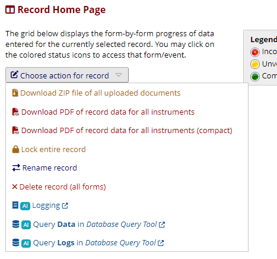
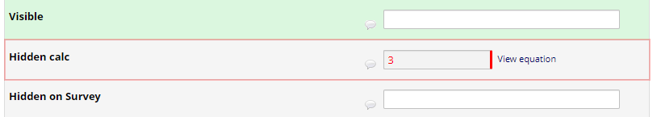

# [ `AI` ] Admin Insights

A REDCap external module giving some insights into projects.

## Requirements

- REDCAP 13.4.1 or newer.

## Installation

Automatic installation:

- Install this module from the REDCap External Module Repository and enable it.

Manual installation:

- Clone this repo into `<redcap-root>/modules/admin_insights_v<version-number>`.
- Go to _Control Center > Technical / Developer Tools > External Modules_ and enable 'Admin Insights'.

## Configuration and Effects

Make sure to **enable the module for all projects** (or for specific projects, e.g. during development). In any case, this module will be invisible to non-admin users.

## Features

### **Record data and logs query links**

Adds shortcuts link for to the _Record Actions_ menu on the _Record Home Page_ that open the _Database Query Tool_ in a new browser tab, automatically performing a query for the record in the _redcap_data_ or the appropriate logs table.  

### **Hidden Field Revealer**
On data entry forms and surveys, if there are hidden fields, a link is provided that will show/hide any fields tagged with `@HIDDEN`, `@HIDDEN-FORM`, or `@HIDDEN-SURVEY`.  

### **Data Entry / Survey Annotations**

 When enabled, field annotations will be displayed on data entry forms and survey pages in the respective field's label. In case the field is embedded, the annotations will be appended to the embedding container.  
   
 Click field names to copy them to the clipboard (wrapped in square brackets when the `CTRL` is pressed while clicking).

### **Online Designer Enhancements**

When enabled, the Online Designer overview will have AI badges that show the field annotations when hovered over (non-empty annotations) or clicked. Click to interact with the popup (to its contents or to edit them).

Clicking on a field name will copy it to the clipboard (press `CTRL` while clicking to wrap it in square brackets).  

Note, editing field annotations is not implemented yet.

## Changelog

Version | Description
------- | --------------------
v1.0.0  | Initial release.
